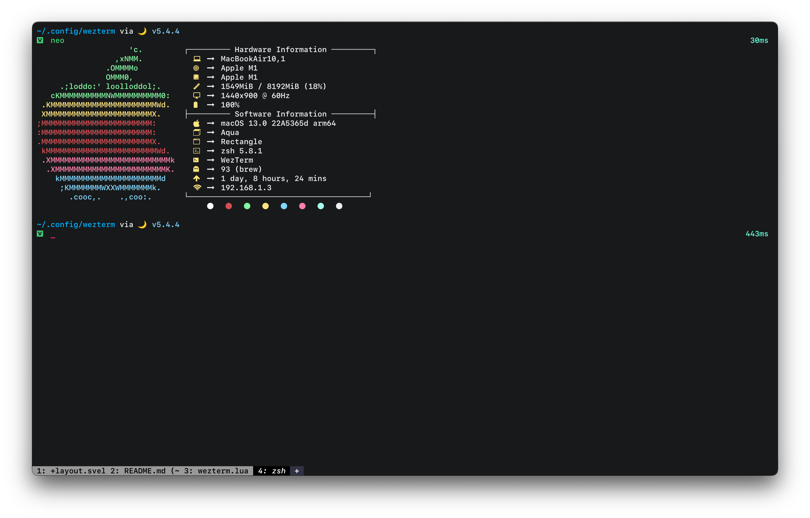

# Dark Flat Wezterm

A dark flat color scheme for Wezterm based on [Iterm 2 Dark Flat](https://github.com/QuentinWatt/dark-flat-iterm-colors)



## 📕 Usage

1. Download with one of two ways

- Clone this repository locally.
- Use `curl` to download color file directly.

```bash
curl -sOL https://raw.githubusercontent.com/cpea2506/dark-flat-wezterm/main/colors/dark_flat.toml
```

2. Create `colors` folder if you're on

- Unix system: in `~/.config/wezterm/`
- Windows: in the same directory as the `wezterm.exe` (usually `C:\Program Files\WezTerm`).

3. Move `dark_flat.toml` to the `colors` directory you've created.
4. Set colorscheme in your WezTerm config file

```lua
local wezterm = require("wezterm")

return {
    -- ..other config
    color_scheme = "Dark Flat",
}
```

5. Enjoy!

## 💝 Thanks to

- [QuentinWatt](https://github.com/QuentinWatt)
- [Catppuccin](https://github.com/catppuccin/wezterm)
